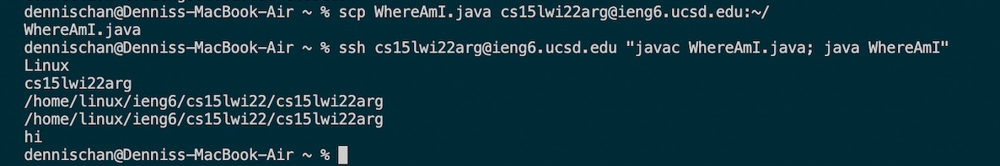

# ***Lab Report 1*** (Logging into ieng6 account)

## 1. Installing VScode

* Download and install Visual Studio Code for your operating system from [here](https://code.visualstudio.com/).
* When you open VSC, your window should look like the picture above.

## 2. Remotely Connecting

* Find your course account from  [here](https://sdacs.ucsd.edu/~icc/index.php).
* In the VSC terminal, run:
```
$ ssh <account>
```
* Type yes if it is your first time connecting to the server.
* Type your password.
* Your terminal should look like the picture in this step.

## 3. Trying Some Commands

* Try to run some commands on both the client (your computer) and the server (remote).
* Some commands to try are: `cd`(change directory), `ls`(list files), `cp`(copy), and `cat`(read and write files).
* Example results from these commands are shown in the picture in this step.

## 4. Moving Files with scp

* The command, `scp`, is run and copies files from the client to the server.
* In the terminal, run:
```
$ scp <file> <account>:~/
```
* Enter your password and the file is now on and can be run from the server.

## 5. Setting an SSH Key

* In order to not have to enter your password when connecting to the server, we can make ssh keys.
* In the terminal, run:
```
$ ssh-keygen
```
* Enter the file and any passphrase.
* Make a .ssh directory on the server.
* In the terminal, run:
```
$ scp <public_key_path> <account>:~/.ssh/authorized_keys
```
* Now, you can ssh and scp without typing a password.

## 6. Optimizing Remote Running

* Write commands in quotes at the end of `ssh` commands to run the command on the server and exiting automatically.
* Use semicolons between commands to run them on the same line.
* Hit the up-arrow to bring up previous commands that were run.