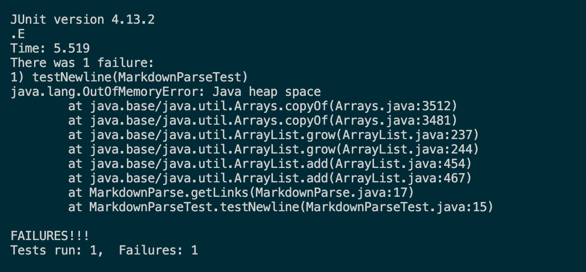
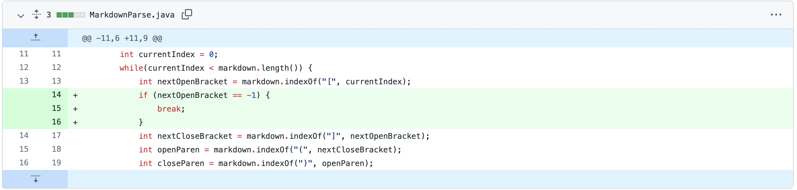
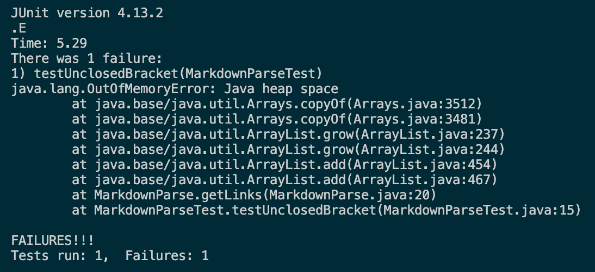
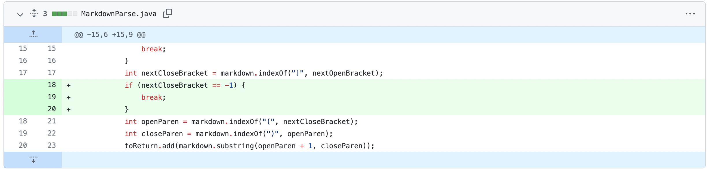
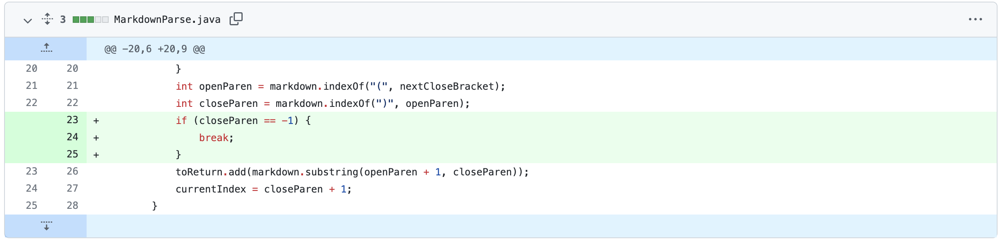

# ***Lab Report 2*** (Debugging)

## **First Update**
[Newline Test File](https://github.com/dlchan66/markdown-parse/blob/main/test-newline-file.md)

*Fail:*

*Fix:*

* The input failed because it had a new line at the very end, which caused a symptom.
* The symptom was an infinite loop and a failed test because of a bug.
* The bug was that when there is a point at which `nextOpenBracket` is not found between the last `closeParen` and the end of the test file, it returns an index of -1, which is not the index we want to be at, and which also prevents the while loop from ending as a result.

## **Second Update**
[Unclosed Bracket Test File](https://github.com/dlchan66/markdown-parse/blob/main/test-unclosed-bracket.md)

*Fail:*

*Fix:*

* The input failed because it was missing a close bracket after an open bracket, which caused a symptom.
* The symptom was an infinite loop and a failed test because of a bug.
* The bug was that when there is a point at which `nextCloseBracket` is not found after a `nextOpenBracket`, it returns an index of -1, which is not the index we want to be at, and which also prevents the while loop from ending as a result.

## **Third Update**
[Unclosed Parenthesis Test File](https://github.com/dlchan66/markdown-parse/blob/main/test-unclosed-paren.md)

*Fail:*

*Fix:*

* The input failed because it was missing a close parenthesis after an open parenthesis, which caused a symptom.
* The symptom was an infinite loop and a failed test because of a bug.
* The bug was that when there is a point at which `closeParen` is not found after an `openParen`, it returns an index of -1, which is not the index we want to be at, and which also prevents the while loop from ending as a result.