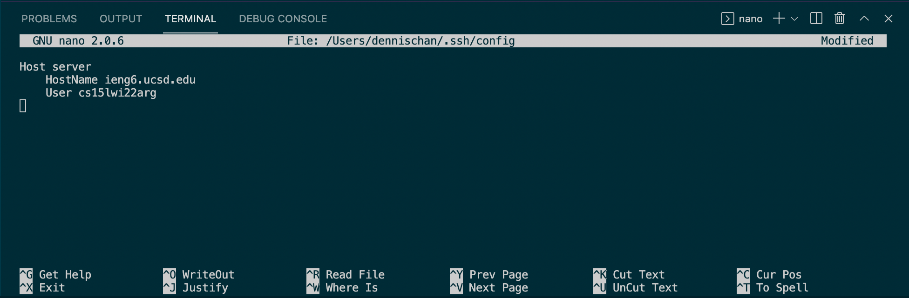
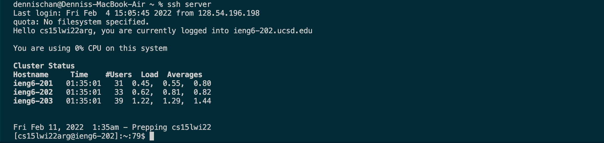
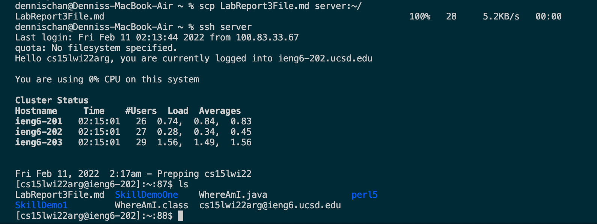

# ***Lab Report 3*** (Streamline `ssh` Configuration)

## `.ssh/config` file

Above is the `.ssh/config` file, opened and edited in Visual Studio Code. I typed in `nano ~/.ssh/config` in the terminal to get to this screen. I named the Host "server".

## `ssh` command

Above is an image of a successful login attempt to a remote computer. Instead of typing `ssh` followed by my account, I can just type in `ssh server` because "server" is the alias I chose for my account.

## `scp` command

Above is an image of me using `scp` to copy the file "LabReport3File.md" into my account, which has the alias of "server". I then logged in to the remote computer using `ssh server` and used `ls` so we can see the "LabReport3File.md" file successfully copied over and present.