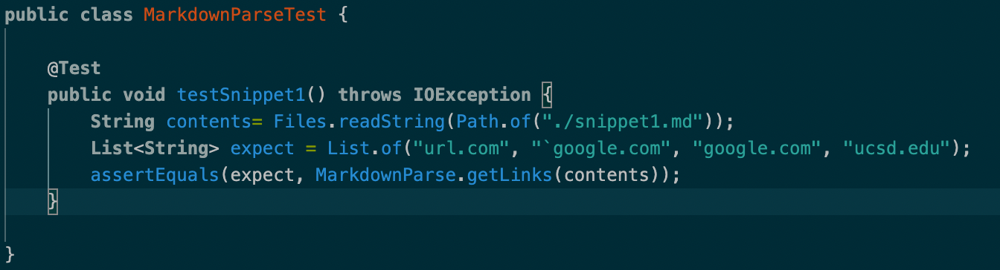
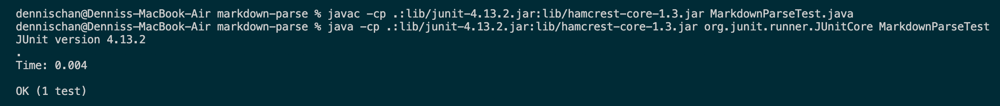
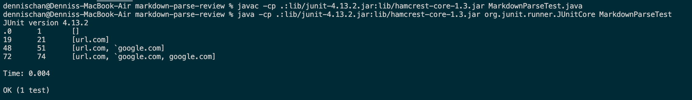
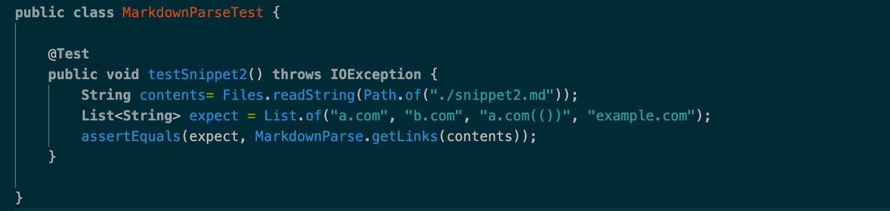
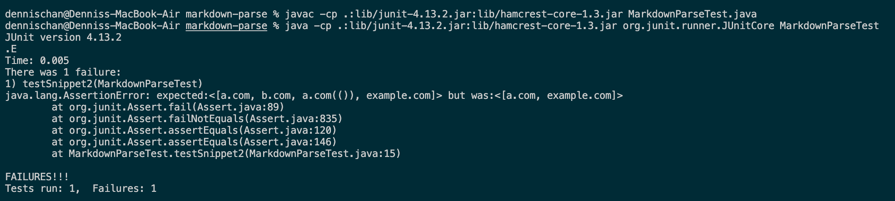
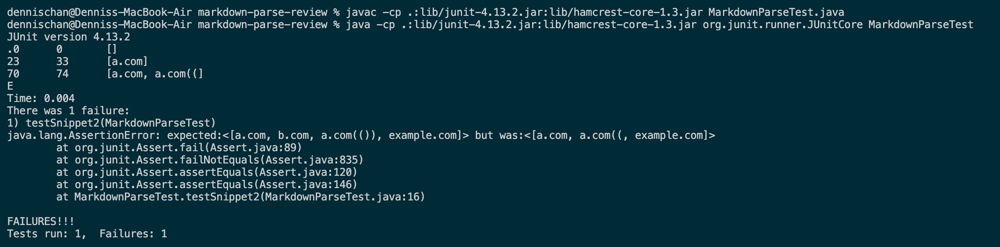
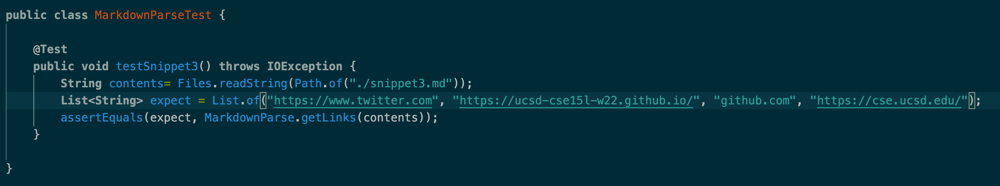
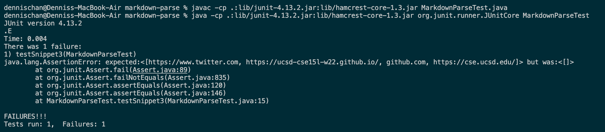
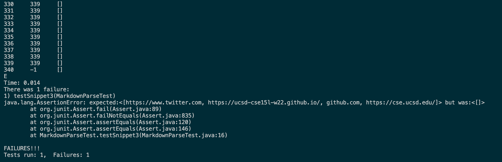

# ***Lab Report 4***

### Links
* [My Repository](https://github.com/dlchan66/markdown-parse)
* [Reviewed Repository](https://github.com/m1ma0314/markdown-parse)

## Snippet 1
*Testing Code*

*My Implementation Output*

**Passed**

*Reviewed Implementation Output*

**Passed**

## Snippet 2
*Testing Code*

*My Implementation Output*

**Failed**

*Reviewed Implementation Output*

**Failed**

## Snippet 3
*Testing Code*

*My Implementation Output*

**Failed**

*Reviewed Implementation Output*

**Failed**

### Questions
* Snippet 1: Both programs work for cases like snippet 1, as they both passed the corresponding test. Therefore, no change is required for cases like this.
* Snippet 2: I don't think there is a small code change that will make the programs work for cases like snippet 2. To have to check and adapt for so many nested conditions (parentheses, brackets, and escaped brackets) seems like it would need more than just 10 lines of code change.
* Snippet 3: I think there is a small code change that will make the programs work for cases like snippet 3. There is only one condition to check for (newlines). I think a potential solution could be to add a loop to remove all spaces and newlines in the markdown file at the very beginning to allow the programs to work without interference from unorthodox spacing.
