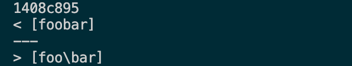
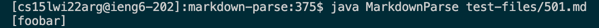
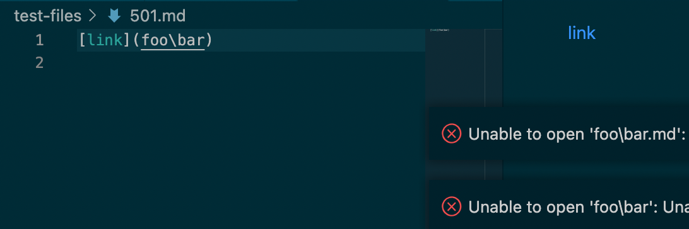
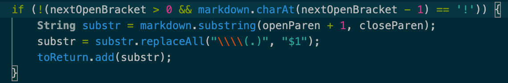
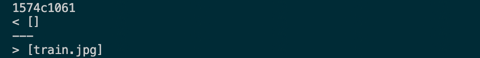
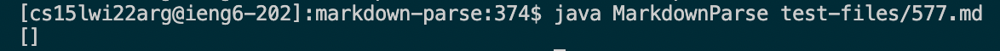
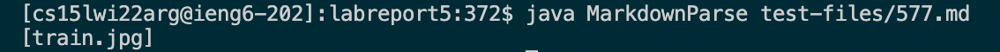
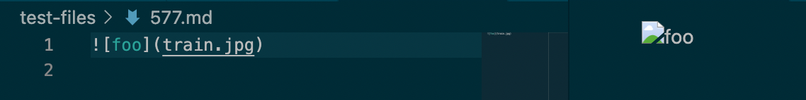
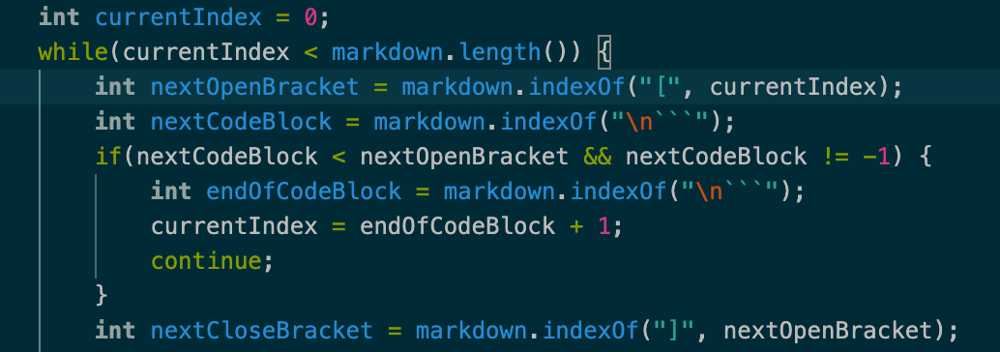

# ***Lab Report 5***

## Test #1 (test-files/501.md)
I found this test which yielded different results by using `diff` on the `results.txt` files generated by running `bash` on a `script.sh` file in both implementations, which outputed the following:

#### For this test, the ***provided*** implementation is correct.
#### My implementation output:

#### Provided implementation output:

#### Expected output: 

As you can see, the expected output is a link that redirects to `foo\bar`, which the provided implementation shows. On the other hand, my implementation outputs just `foobar`, failing to produce the backslash in the output.
#### My implementation bug:

As seen here, my implementation takes out the backslashes between `openParen` and `closeParen` before adding the link to the list of links. However, we can clearly see in the preview that the backslash is supposed to be in the link when outputed.

## Test #2 (test-files/577.md)
I also found this test which yielded different results by using `diff` on the `results.txt` files generated by running `bash` on a `script.sh` file in both implementations, which outputed the following:

#### For this test, ***my*** implementation is correct.
#### My implementation output:

#### Provided implementation output:

#### Expected output:

As you can see, the expected output is an image, not a link. My implementation correctly produces no links. However, the provided implementation outputs the link, `train.jpg` when it isn't supposed to output anything.
#### My implementation bug:

The problem in the provided implementation is that it doesn't check for an exclamation mark (!) before `nextOpenBracket`. An exclamation mark there would indicate the presence of an image, and not a link. Since the code doesn't check for images, it ignores the exclamation mark and ends up adding a link to the output when no links are actually present.
